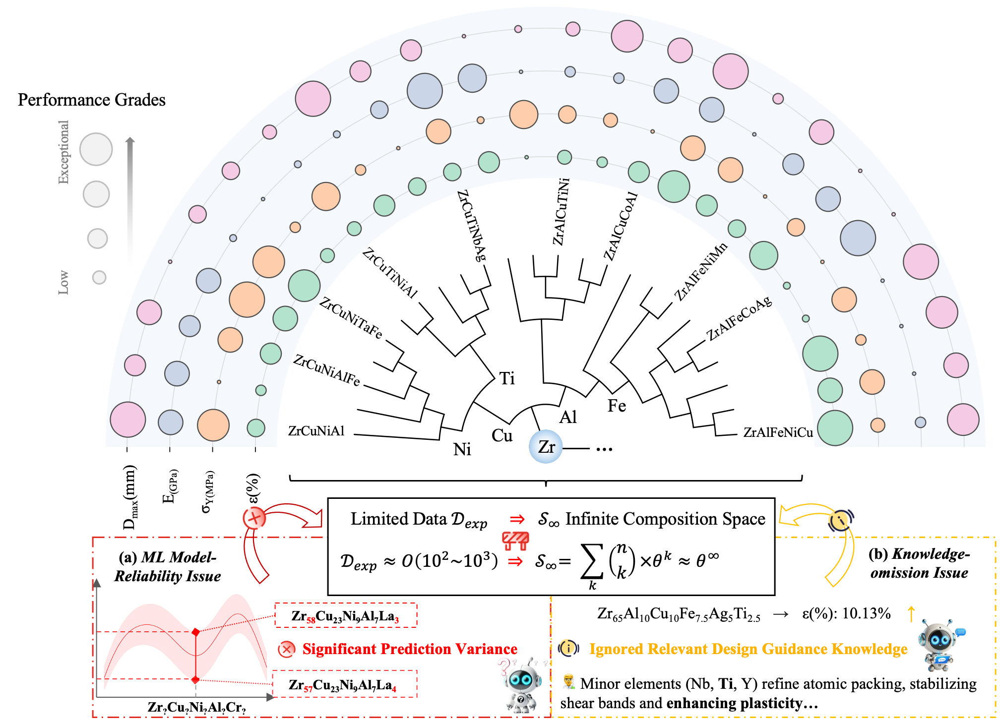
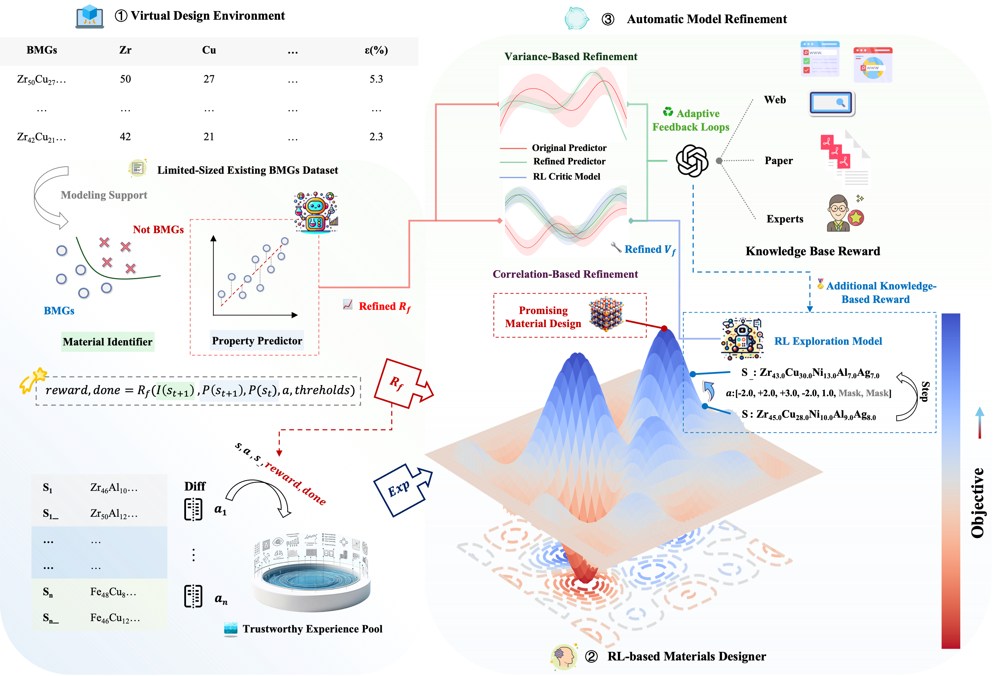
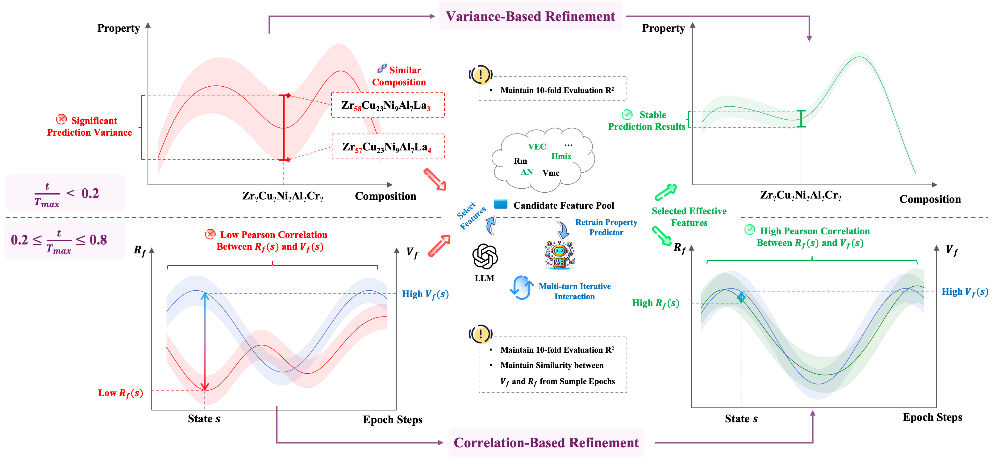
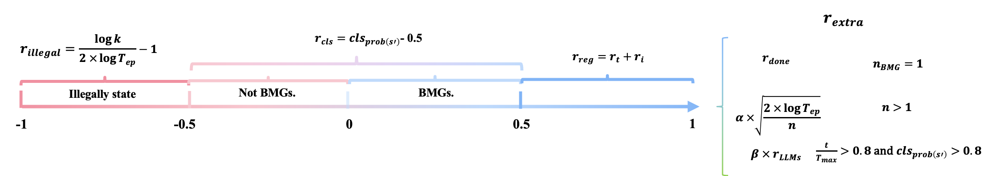
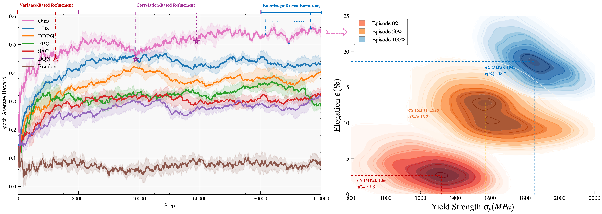
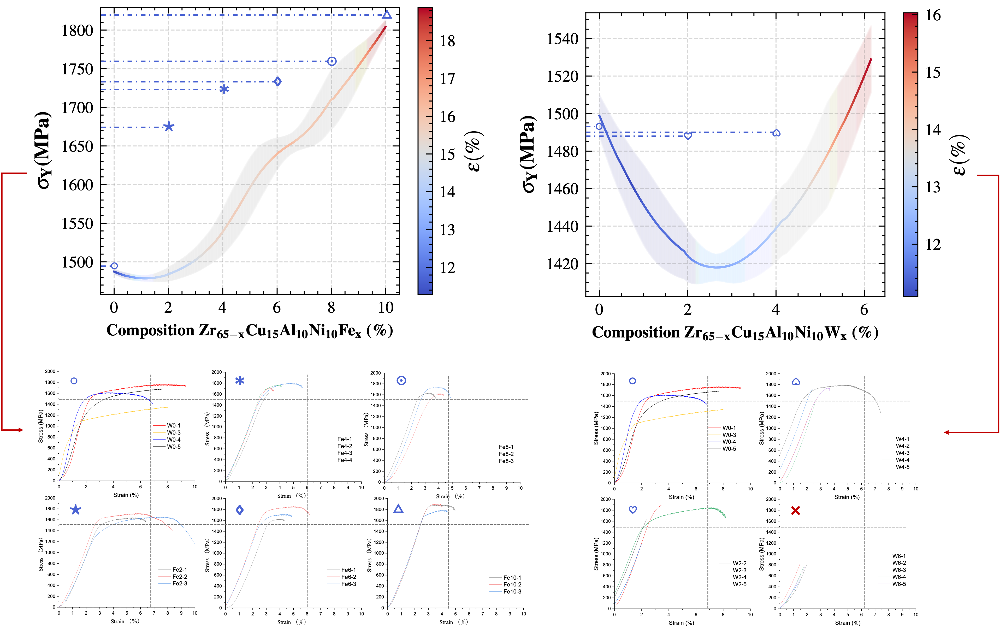

# AIMatDesign
**Paper Title:** ***AIMatDesign: Knowledge-Augmented Reinforcement Learning for Inverse Materials Design under Data Scarcity***

> **TL;DR** – AIMatDesign couples reinforcement learning with large language model (LLM) reasoning to **augment scarce experimental data**, **auto-refine unreliable surrogates**, and **inject expert knowledge** into the reward signal, enabling closed-loop discovery of high-performance bulk metallic glasses (BMGs) from a practically infinite composition space.

---

## 🌟 Highlights

|  |
|:--:|
| **Figure 1 – Challenges in inverse materials design.** |

| Challenge | AIMatDesign Solution |
|-----------|----------------------|
| **Data scarcity** in high-dimensional composition space | **Trusted Experience Pool (TEP)** &nbsp;– difference-based augmentation grows the training set with physically consistent synthetic samples |
| **Unreliable surrogate predictions** | **Automatic Model Refinement (AMR)** &nbsp;– *variance-* & *correlation-* based triggers call an LLM to patch surrogate outputs on-the-fly |
| **Missing domain knowledge** | **Knowledge-Based Reward (KBR)** &nbsp;– embeds expert heuristics (e.g. Ti-induced plasticity) directly into the RL reward |
| **Slow RL convergence** | Progressive curriculum + TEP + AMR jointly speed up exploration and stabilise learning |
| **Experimental validation** | Predicted Zr-based alloy achieved **1.7 GPa** yield strength & **10.2 %** elongation – within experimental error of the forecast |

---

---

## 📐 Framework at a Glance

|  |
|:--:|
| **Figure 2 – Overall workflow of AIMatDesign.** |

1. **Data Augmentation (TEP)**  
   Difference-based sampling inflates the sparse experimental set into a *Trusted Experience Pool*.

2. **RL Exploration**  
   PPO/DDPG agent iteratively proposes compositions; surrogates predict properties.

3. **Automatic Model Refinement (AMR)**  
   When variance/correlation drift is detected (see ), an LLM revises surrogate outputs to maintain reward fidelity.

4. **Knowledge-Based Reward (KBR)**  
   Expert rules () bias the reward toward physically plausible, high-value regions.

5. **Training Dynamics**  
   Convergence and reward evolution are shown in .

---

## 🔬 Key Results

|  |
|:--:|
| **Figure 3 – Prediction trends (top) and stress–strain curves of synthesised Zr-based alloys (bottom).** |

AIMatDesign surpassed grid search, NSGA-II, and vanilla RL baselines in

* **Discovery efficiency** – fewer iterations to first viable alloy  
* **Convergence speed** – smoother reward trajectory  
* **Success rate** – higher proportion of hits meeting multi-objective targets  

---

## 🚀 Quick Start

_Code coming soon!_  
The full training pipeline, pretrained surrogates, and Jupyter notebooks will be released after code clean-up and license review.

> **Planned requirements**
> * Python ≥ 3.8
> * PyTorch ≥ 2.2
> * HuggingFace Transformers (for LLM calls)
> * RDKit / Matminer for featurisation
> * CUDA-enabled GPU (A100 recommended)

Stay tuned – feel free to click ⭐ **Star** to receive a notification when we push the first commit.